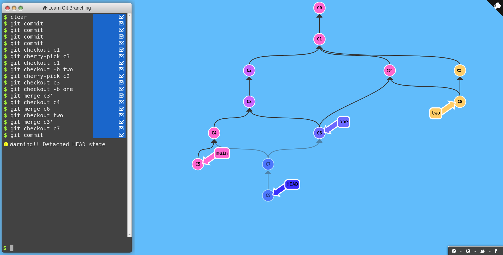

Sprawdzian nr 2 PWI 2020
=======================
Macie do wykonania dwa proste zadania. Wyniki swojej pracy powinniście umieścić w mini-sprawozdaniu sformatowanym według standardu *Markdown*.

Zadanie 1
---------


Obrazek mówi sam za siebie i chodzi oczywiście by stworzyć podobny przy użyciu znanej Wam już [strony](https://learngitbranching.js.org/?NODEMO). 
W sprawozdaniu poza wynikowym zrzutem ekranu napiszcie listę komend, która doprowadziła Was do finalnego rezultatu.

## Rozwiązanie




Zadanie 2
---------
W pliku _zadanie2.txt_ znajdują się zahashowane(SHA256) numery indeksów. Należy dowolnymi poleceniami
+ odnaleźć swój numer 
+ dowiedzieć się który commit *dodał* tę linijkę do pliku
+ przejść do tego commita 
+ utworzyć nową gałąź i commit w którym umieścić należy sprawozdanie ze sprawdzianu (uzupełnione o listę poleceń z tego zadania)
+ zrobić pull-request do oryginalnego repozytorium z tym commitem

## Rozwiązanie

+ Komendą ```echo -n 325024 | sha256sum``` znalazłem hash mojego indeksu.
+ Do tego użyłem git bisect. Najpierw git bisect start, git bisect good *pierwszy commit* (jego hash znalazłem poleceniem ```git log --reverse```, git bisect bad HEAD, a następnie sprawdzałem ```grep 8d36e6139240e2a1795c92d6412642b5fea226db8a2314acbc483d59e8581a88 zadanie2.txt``` czy znajduje się mój zahashowany indeks. Jeżeli się znajdował to git bisect bad, a jeżeli nie to git bisect good. Wypluło mi tego commita co został dodany mój indeks.
+ Przełączyłem się na niego ```git checkout *hash*```
+ Utworzyłem gałąź i przełączyłem się na nią ```git checkout -b sprawozdanie``` i  skomitowałem zmiany ```git commit -m "Add sprawozdanie"```
