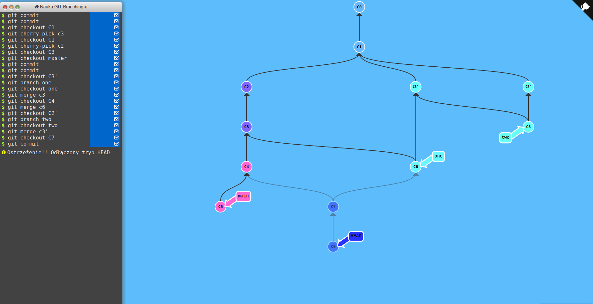

Zadanie 1
=========

Lista komend: 
+ git commit
+ git commit
+ git checkout c1
+ git cherry-pick c3
+ git checkout c1
+ git cherry-pick c2
+ git checkout c3 
+ git checkout master
+ git commit
+ git commit
+ git checkout c3'
+ git branch one
+ git merge c3
+ git checkout c4
+ git merge c6
+ git checkout c2'
+ git branch two
+ git checkout two
+ git merge c3'
+ git checkout c7
+ git commit

Zadanie 2
=========

1. Znalezienie swojego zahashowanego numeru indeksu poleceniem *echo -n 324807 | sha256sum*
2. Odnalezienie komita, który dodał znalezioną linijkę tekstu poleceniem *git log -S147849b95dd44f7402438d6761bc091228c02fca32b27619d0f60d2f76e1ba97*
3. Przełączenie się na powyższego commita poleceniem *git checkout 9e929b831922b56b0e22bf66d6a4644662c2f481*
4. Utworzenie (i przełączenie się na nią) poleceniem *git checkout -b newbranch*

