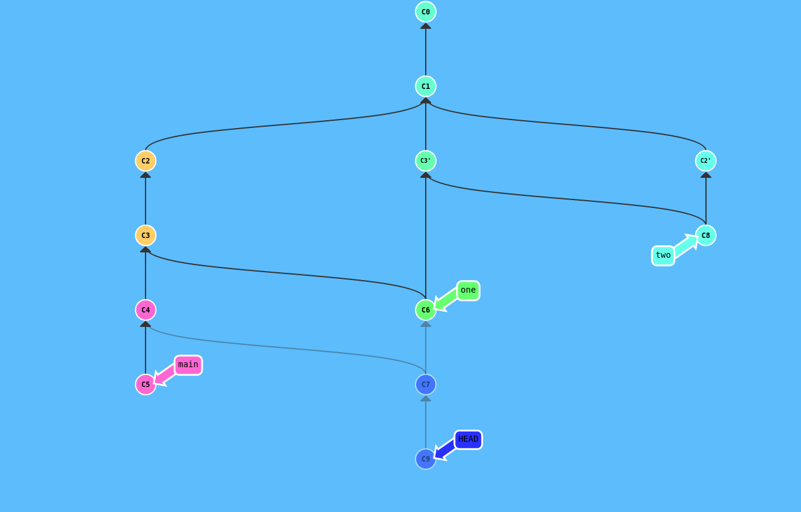

Sprawdzian nr 2 PWI 2020  
Mateusz Marszałek 323941
=======================

Zadanie 1
---------

Lista komend:  
git commit  
git commit  
git checkout c1  
git branch one  
git cherry-pick c3  
git checkout c1  
git branch two  
git checkout two  
git cherry-pick c2  
git checkout main  
git commit  
git commit  
git checkout one  
git merge c3  
git checkout c6  
git merge c4  
git checkout two  
git merge c3'  
git checkout c7  
git commit  

Zadanie 2
---------
+ Używając komend echo i sha256sum sprawdziłem jaki hash ma mój numer indeksu (echo -n 323941 | sha256sum)
+ Następnie użyłem git annotate, który zwraca informacje o poszczególnych wierszach w pliku tekstowym (numer commita, który dodał wiersz, kto dodał wiersz, zawartość wiersza itp.), żeby znaleźć numer odpowiedniego commita. (nr. commita-0290e77e)
+ Następnie przeszedłem do tego commita, utworzyłem nową gałąź i nowego commita ze sprawozdaniem.

