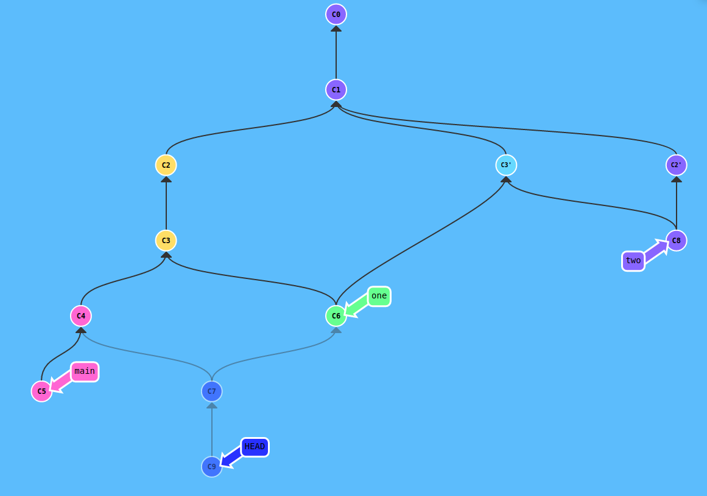

Rozwiązanie zadania 1
---------

Lista komend:

git commit

git commit

git checkout C1

git cherry-pick C3

git checkout C1

git cherry-pick C2

git checkout main

git commit

git commit

git checkout C3

git branch one

git checkout one

git merge C3'

git checkout C4

git merge C6

git checkout C2'

git branch two

git checkout two

git merge C3'

git checkout C7

git commit

Rozwiązanie zadania 2
---------
Odpowiedni commit znalazłem za pomocą git bisect. 
Ostatni commit oznaczyłem jako git bisect bad, a następnie znalazłem za pomocą git log --reverse pierwszy commit w którym dodano numery indeksów i oznaczyłem jako git bisect good. 
W kolejnych commitach sprawdzałem czy w zadanie2.txt jest mój numer. 
Jeżeli znalazłem to oznaczałem jako git bisect bad, a w przeciwnym wypadku jako git bisect good. 
Gdy znalazłem odpowiedni commit stworzyłem nową gałąź i dodałem sprawozdanie.
