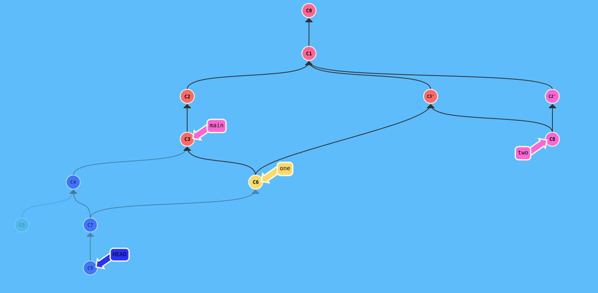

<h1>Sprawozdanie z kolokwium 2</h1>

<h2>Zadanie 1</h2>



Użyte komendy:
```
git commit
git commit
git checkout C1
git cherry-pick C3
git checkout C1
git cherry-pick C2
git checkout C3
git commit
git commit
git checkout C3
git merge C3'
git merge C4
git checkout C3'
git merge C2'
git checkout C6
git branch one
git checkout C8
git branch two
git checkout C7
git commit
```

